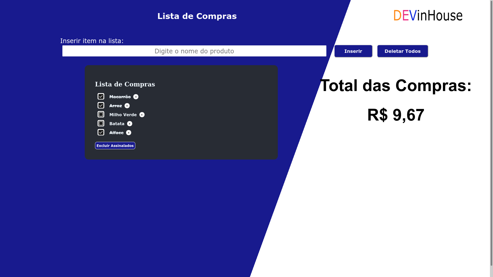

<h1 align="center">Nome: Maycon Campos</h1>
<h3 align="center">Estudante FullStack no curso SENAI DEVinHouse[ConectaNuvem]</h3>

Projeto Avaliativo DEVinHouse - Módulo 01 - Projeto 01

<h3>Professores:</h3>

 Romeu Isaac Casarotto

 Ana Paula dos Santos

 Cesar Abascal

 Fernando Puntel

<h2>REQUISITOS DA APLICAÇÃO</h2>

A aplicação que deverá ser realizada individualmente, deve contemplar os seguintes
requisitos:

<ol>
    <li>Um título na aba do navegador, para que o usuário encontre a sua aplicação no meio
    das várias abas que constantemente mantém abertas;</li>
    <li>Um cabeçalho dentro da página, para que o usuário saiba facilmente em que página se
    encontra e do que se trata o conteúdo;</li>
    <li>Um campo de texto para digitar o nome do produto a ser adicionado à lista;</li>
    <li>Um botão para adicionar um novo produto na lista;</li>
    <li>Um botão para deletar todos os itens de uma única vez;</li>
    <li>Um botão para deletar todos os itens que estejam marcados como comprado;</li>
    <li>Uma lista contendo os produtos já inseridos;</li>
    <li>Cada linha da lista deve conter: checkbox para o usuário marcar aquele produto que já
    foi comprado; o texto que o usuário digitou ao cadastrar a atividade; botão para
    excluir o produto da lista, caso desejado;</li>
    <li>Quando o usuário marcar um item da compra, deve-se abrir um pop-up para que o
    usuário digite o valor da compra, após isso, deve-se somar ao valor total das compras;</li>
    <li>A lista deve ser salva no "localStorage" do navegador (incluindo os produtos que já
    foram realizados), e deve ser carregada sempre que a página for reaberta.</li>
</ol>

<h1 align="center">Print do Projeto Pronto</h1>

<h3 align="left">Connect with me:</h3>

<h3 align="left">Languages and Tools:</h3>

 
 
  
 
 

